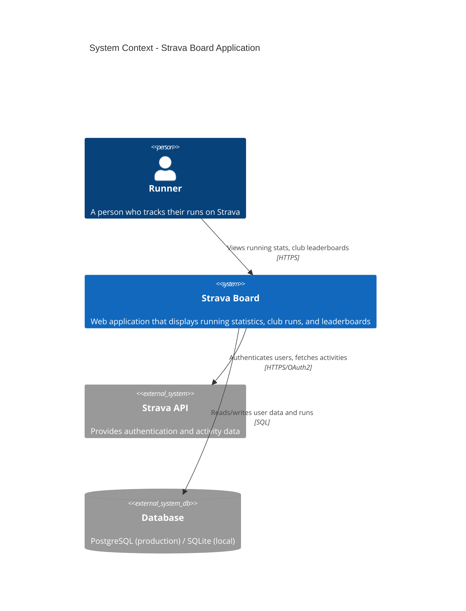
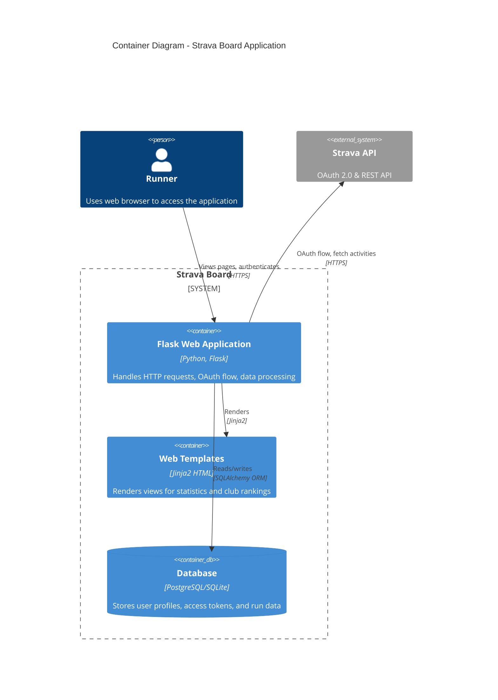
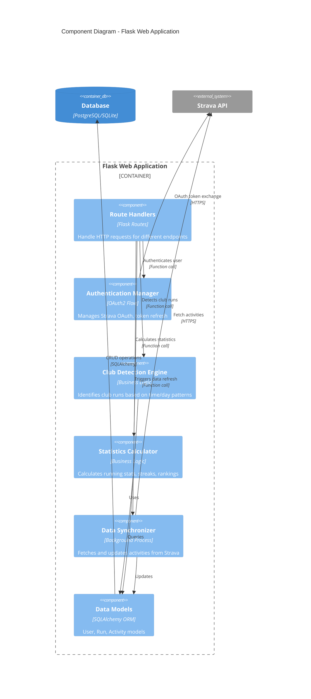
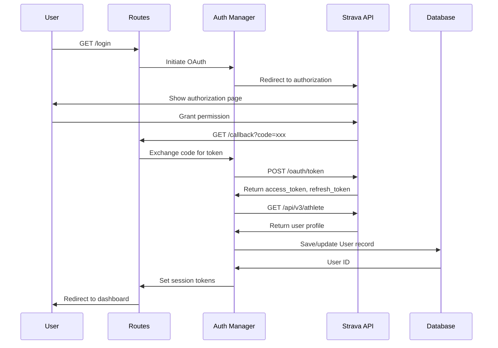
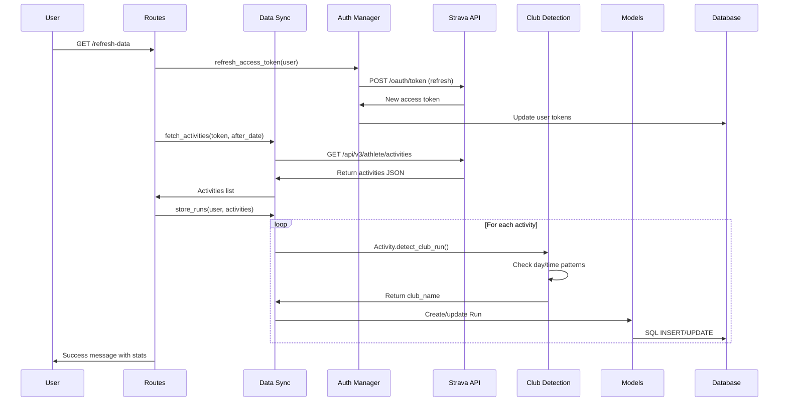
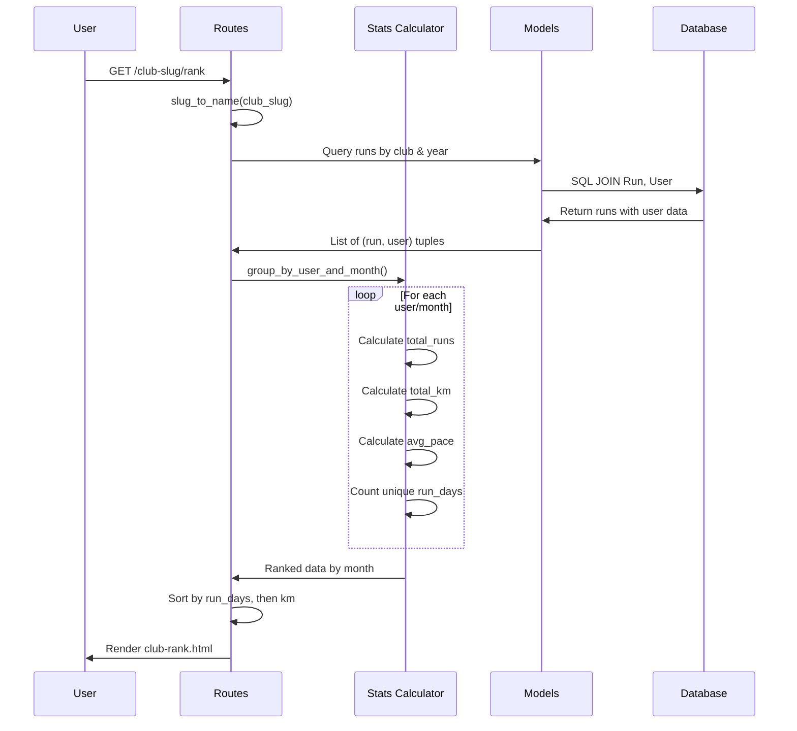
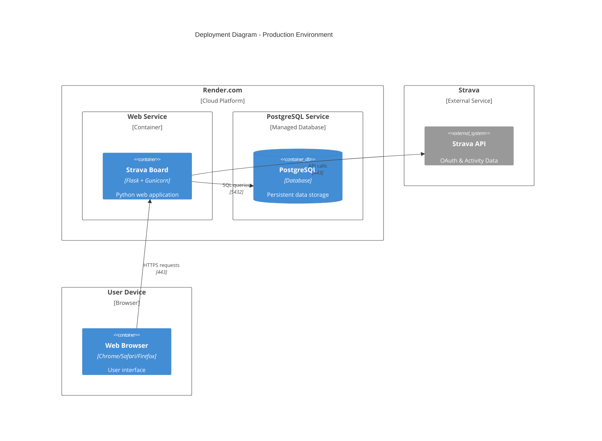
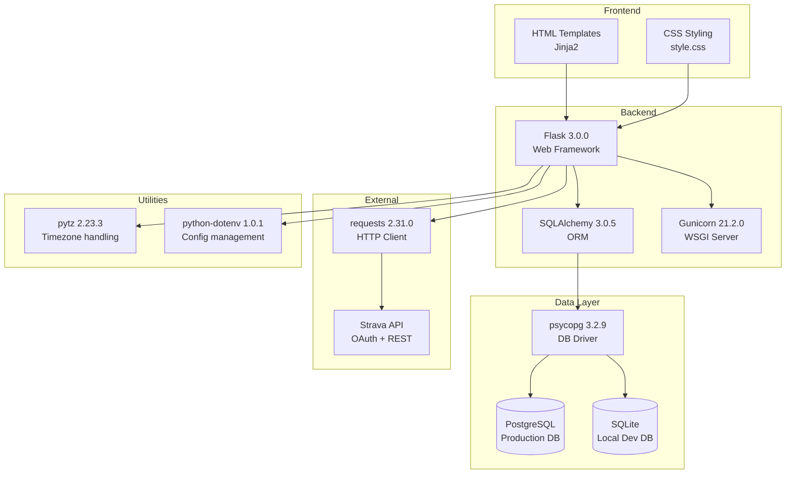

# Architecture Documentation

## C4 Model Diagrams

### Level 1: System Context Diagram



### Level 2: Container Diagram



### Level 3: Component Diagram



### Level 4: Code Diagram - Authentication Flow



### Level 4: Code Diagram - Data Refresh Flow



### Level 4: Code Diagram - Club Ranking Flow



### Data Model Diagram

```mermaid
erDiagram
    USER ||--o{ RUN : creates
    USER {
        int id PK
        string strava_id UK
        string name
        string profile_photo
        string access_token
        string refresh_token
        datetime token_expires_at
    }
    RUN {
        int id PK
        int user_id FK
        string strava_activity_id UK
        string name
        datetime start_date
        datetime start_date_local
        float distance
        int moving_time
        string club_name
        json raw_json
    }
    ACTIVITY {
        note "Dataclass - not persisted"
        int id
        string name
        float distance
        int moving_time
        datetime start_date
        string club_name
    }
    RUN ||--|| ACTIVITY : "maps to"
```

### Deployment Diagram



### Technology Stack



## Key Architectural Decisions

### 1. Database Strategy
- **Production**: PostgreSQL with psycopg driver
- **Development**: SQLite for simplicity
- **Rationale**: Easy local development, robust production deployment

### 2. Authentication
- **OAuth 2.0** flow with Strava
- Token refresh mechanism for long-lived sessions
- Session-based user state management

### 3. Club Detection
- Time-window based pattern matching
- Configurable per club (days, time ranges)
- Reprocessable for historical data

### 4. Data Synchronization
- Manual refresh trigger (`/refresh-data`)
- Initial sync on OAuth callback
- Fetches last 2 years of activities

### 5. Ranking Algorithm
- Primary: Unique run days (encourages consistency)
- Secondary: Total kilometers (rewards volume)
- Grouped by month for temporal comparison

