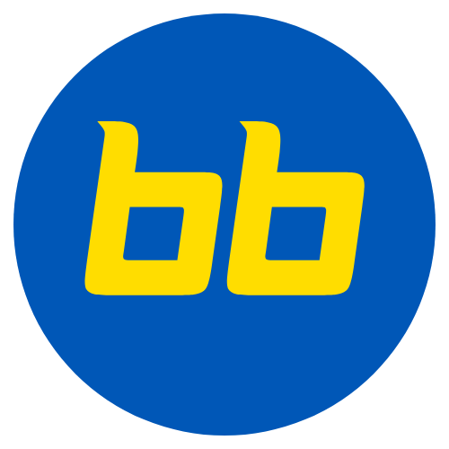
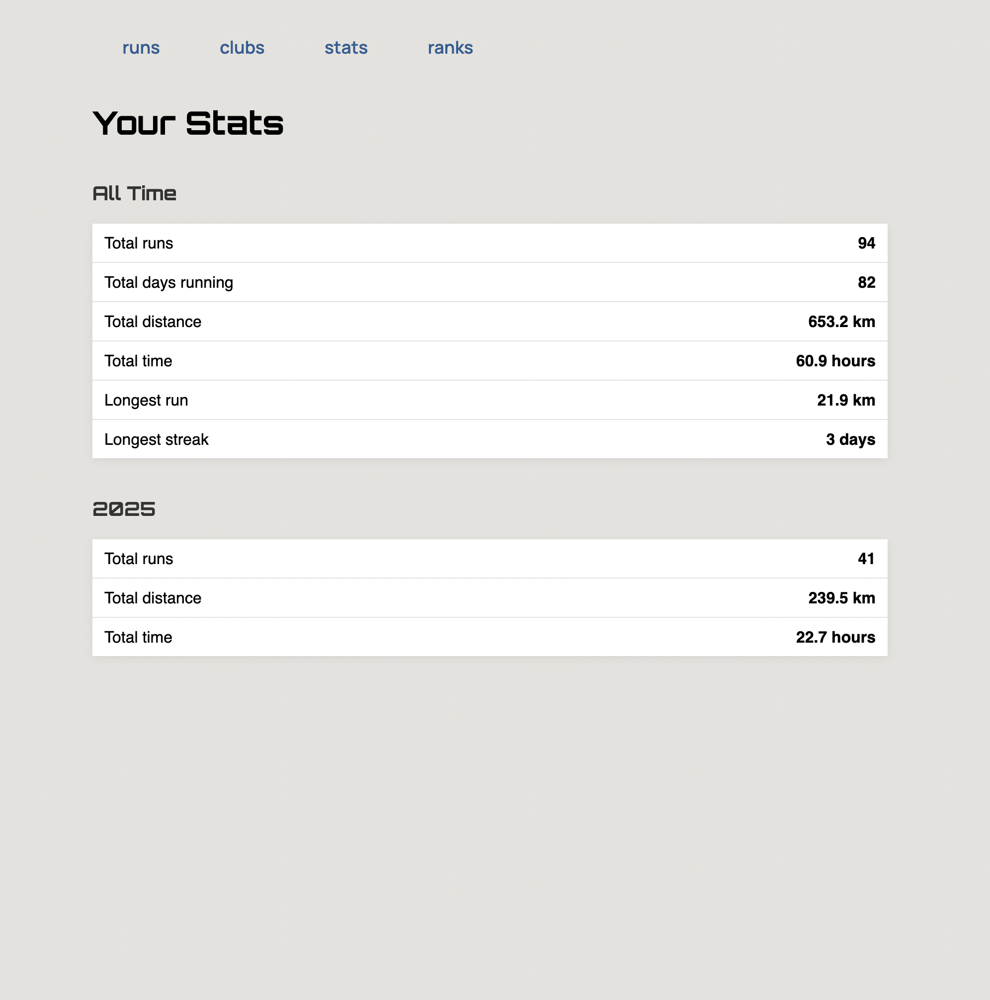

# bih-board

<table>
<tr>
<td width="200">
  
</td>
<td>
  bih-board is a simple Strava dashboard for clubs and teams. Members authorize access to share and view activities and stats; authorized members can see each other's activities. Designed for running clubs—runs are tagged as club activities when they match predefined criteria (location, date, and time range).
</td>
</tr>
</table>

The app is currently deployed at:
https://berry.tailb7538f.ts.net




## Deployment

Export environment variables for Strava API credentials before deploying the application.

Go to https://www.strava.com/settings/api to create an application and obtain your `STRAVA_CLIENT_ID` and `STRAVA_CLIENT_SECRET`. 

Set the `STRAVA_REDIRECT_URI` to point to your deployed application's callback endpoint.

```bash
export STRAVA_CLIENT_ID=your_strava_client_id
export STRAVA_CLIENT_SECRET=your_strava_client_secret
export STRAVA_REDIRECT_URI=https://yourdomain.com/callback
```

To deploy the BIH Board application, follow these steps:
1. Fetch the latest version of the Docker Compose file:
   ```bash
   curl -o docker-compose.yml https://raw.githubusercontent.com/skvortsovden/bih-board/main/docker-compose.yml
   ```
2. Start the application using Docker Compose:
   ```bash
   docker-compose up -d
   ```

## Strava limitations

### Error 403: Limit of connected athletes exceeded

Strava API has a limitation on the number of athletes that can be connected to an application. If you encounter the error "403: Limit of connected athletes exceeded," it means that your application has reached this limit. To resolve this issue, you may need to disconnect some athletes from your application or request an increase in your application's limits from Strava.

### Solution
You can request an increase in your application's limits by filling out this form:
https://share.hsforms.com/1VXSwPUYqSH6IxK0y51FjHwcnkd8
